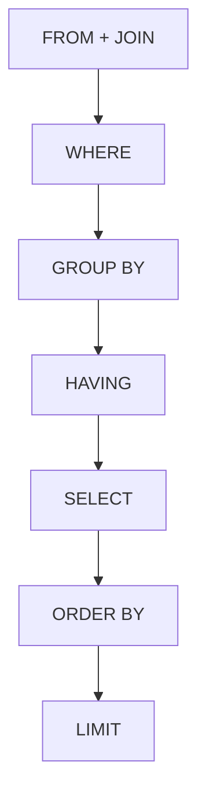
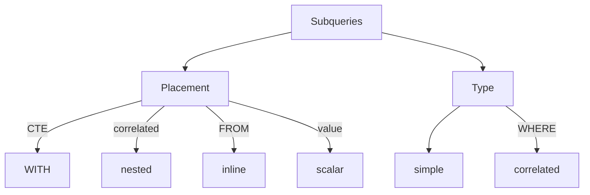

# SQL Basics

## SQL Order of Execution

[Mermaid cheat sheet](https://jojozhuang.github.io/tutorial/mermaid-cheat-sheet/)



## IN | BETWEEN

### IN

- Double quotes “” if there is an apostrophe in the text
    - How to escape apostrophe
        - Macy’s —> Macy’’s

### BETWEEN

Jan 1, 2016 - Dec 31, 2016

```jsx
BETWEEN '2016-01-01' AND '2017-01-01'
```

## NORMALIZATION

PK → Exists in every table; is unique

FK → Can have duplicates in other tables

1NF → All unique records have their own rows → no keys

2NF → All columns are determined only by PKs → PK only

3NF → All columns are determined by PK/FK → PK/FK (aka no transitive dependency)

4NF → All 1:n dependency → PK/FK for every column

- many-to-many → [not allowed in traditional databases; breaks down the schema](https://stackoverflow.com/a/7339250)
    - Multiple author_id columns for each book in the Books table → X

## Filtering on JOIN vs WHERE

**6912 rows**

```sql
**--** **includes NULLs for rows where sales_id <> 3250**
SELECT ...
FROM orders o
LEFT JOIN accounts a ON o.acconut_id = a.id AND a.sales_id = 3250
```

**134 rows**

```sql
**-- no nulls because non-matching rows are filtered out after JOIN**
SELECT ...
FROM orders o
LEFT JOIN accounts a ON o.acconut_id = a.id
WHERE a.sales_id = 3250
```

## DISTINCT

COUNT DISTINCT → very expensive

DISTINCT + aggregations → slow

## Aggregation functions

### COUNT

- Ignores null values during calculation
- Can be applied on any data type

### SUM

- Ignores null values during calculation
- Works only with numeric columns

### MIN | MAX

- Ignores null values during calculation
- Works on non-numeric data
    - MIN/MAX (date, string, number)
        - MIN(date) → earliest date
        - MIN(string) → closest to ‘z’
        - MAX(date) → latest date
        - MAX(string) → closes to ‘a’

### Column-wise vs Row-wise aggregations

Column-wise → use aggregation funcitons

Row-wise → use arithmetic operators e.g. + - * /

## GROUP BY

- GROUP BY dates → not very useful
- Placed between WHERE and ORDER BY
- How to use **LIMIT** with GROUP BY
    - GROUP BY first, LIMIT afterwards
    - After you GROUP BY a column, if you end up with more unique values that the LIMIT imposed e.g. you get 15 unique rows but you are using LIMIT 10, then LIMIT will randomly cut out 5 rows
- Order of column names in GROUP BY
    - The order of column names in the GROUP BY clause doesn’t matter — the results will be the same regardless

### Why use column numbers?

- To keep track of which column we are GROUP-ing and ORDER-ing BY with
- It reduces mistakes that can be made while typing a column name
- Saves time by not having two write entire aggregate functions in GROUP/ORDER BY

### Aggregation in GROUP BY

Single row output → GROUP BY required

```sql
SELECT total_amt_usd,
		COUNT(1) AS total_count
FROM orders
GROUP BY 1
```

Append aggregated result to every row → GROUP BY not required

```sql
SELECT total_amt_usd,
		(SELECT COUNT(1) FROM orders) AS total_count
FROM orders
```

### **When GROUP BY can be avoided**

1. Find earliest occurrence
2. Find most recent occurrence

**Edge case**

When finding the earliest or most recent events or smallest, you can use MIN(). However, there is an edge case where you may end up with ties. For example, if multiple orders were placed on exactly the same second or even microsecond (can easily happen on Amazon on Black Friday or Boxing Day with a millions of orders placed on a single day), then trying to find the earliest or most recent event will show only 1 result and omit the rest. However, it's not correct. To find all such orders, you can use the `RANK() OVER (ORDER BY )` window function and retain all orders with `rank = 1`.

### **HAVING**

- Cleaner way to filter aggregated data
- Alternative → subqueries
- The HAVING clause cannot have aliases
    - You need to use the actual column names
    - You need to write the entire aggregation operation that you may perform over the column

## DATE functions

### DATE_TRUNC

- common → day, month, year
- all → microsecond, millisecond, second, minute, hour, day, week, month, quarter, year, decade, century, millennium
    - 2015-01-06
        - decade → 2010-01-01T…
        - century → 2001-01-01T…
        - millennium → 2001-01-01T…
    - 1995-01-06
        - century → 1901…
        - millennium → 1001…

### DATE_PART

- all of DATE_TRUNC functions +
- dow, doy, epoch (seconds since 1970-01-01, can be -ve)

### Other DATE functions

AGE, EXTRACT, OVERLAP (boolean), CURRENT_DATE (includes timezone), CURRENT_TIMESTAMP (aka NOW() )

## CASE

```sql
CASE WHEN std_qty = 0 OR std_usd = 15 THEN 0
		 ELSE std_qty/100 END AS metric
-- else is optional
```

- Always inside SELECT
- Can include multiple WHEN and ELSE
- Can convert aggregations shown in rows to columns (almost like PIVOT)
- Allows multiple WHERE clause-like execution whereas you can have only 1 WHERE clause

## Subqueries



- Nested & inline → doesn’t need alias (often)
- Scalar
    - multiple matches → error
    - no match → NULL
- Correlated subqueries → dependent on outer query

### Subqueries vs JOIN

- Manipulation / aggregation is done before JOIN
- Can be run independently
- Doesn’t stitch tables using a key (unlike JOIN)
- Query plans are similar to JOIN

## VIEW

```sql
CREATE VIEW view_name
AS
SELECT *
FROM table1 t1
JOIN table2 t2 ON t2.id = t1.id
WHERE t1.col = value 
```

- UPDATE may not be possible
- INSERT / DELETE rows of base table
    - only if VIEW is created from a single base table (no JOIN)
- Alter VIEW definition
    - Yes, can be done on Oracle or IBM DB2
        - `CREATE OR REPLACE VIEW`

## CAST

`CAST (column as type)`

`column::type`

**Data types** → decimal, integer, char, varchar, double, double precision, boolean, timestamp, interval etc.

## String manipulation

### LEFT | RIGHT

(string, number_of_chars)

### SUBSTRING

(string, start, length)

### POSITION

(substring IN string) → returns the 1st occurrence

**→** When a column holds a lot of text

### STRPOS

(string, substring)

→ When every column has raw text data

### REPLACE

(string, string_to_be_replaced, string_to_replace_with)

## NULL or missing values

### COALESCE

(str1, str2, str3,…)

- Returns the first non-null value in a list
- Can be used to combine columns where only 1 of them has data and the rest are NULL
    - Usually indicator columns
        - apartment, amenity, exterior → (2bhk, NULL, NULL) → 2bhk
        - apartment, amenity, exterior → (NULL, Gym, NULL) → Gym
        - apartment, amenity, exterior → (NULL, NULL, exterior) → exterior
        - apartment, amenity, exterior → (NULL, Gym, exterior) → Gym

### How to deal with missing values

- Use COALESCE
- DROP records
- Impute
    - Often using median or mode
    - Normalization → standardize or clean up
        - Adjusting a varied distribution → **z-score** transformation

## Window functions

- Retains all records
- Included in SELECT
- Cannot be included in GROUP BY
- No ORDER BY ⇒ `ORDER BY 0` ⇒ `ORDER BY NULL`

### RANK

If you want to filter by RANK in a WHERE clause, you need to first RANK items in a subquery or using a CTE.

### DENSE_RANK

Ranks are not skipped for ties

### WINDOW: Aliasing window functions

```sql
SELECT col1,
			 col2,
			 RANK() OVER **monthly_window** AS rank
FROM table
WHERE col1 = [value]
**WINDOW** **monthly_window** AS
					(PARTITION BY col2 ORDER BY col3)
ORDER BY col2
```

### Running total

```sql
SUM(col) OVER (ORDER BY date)
```

### Moving average (to check)

```sql
AVG(col) OVER (ORDER BY date)
```
